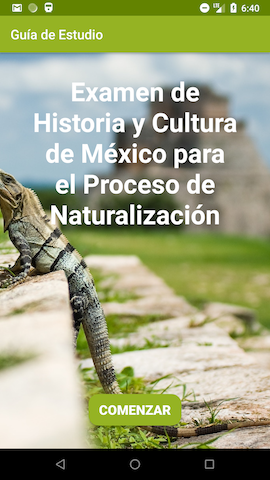

# Guia de Estudio - ABND Project 3

## Examen de Historia y Cultura de Mexico para el Proceso de Naturalization

DREAMers, who are people who were brought to the United Stated by their parents as children
without inspection are now undocumented. Most of these people qualify for the Deferred Action
for Childhood Arrivals (DACA) executive order protection that President Obama enacted. However, a single
traffic violation, such as a DUI, is enough to loose your DACA protection and be deported, even if
you have been in the USA for decades.

When someone is deported to Mexico and they do not know the country, they can seek advice from the
Mexican immigration services. One of the things they are asked to do is to take a Mexican History and
Culture test, the same that people looking to naturalize will do.

Maybe one day this app can be an actual study tool that can help all these DACA people who lost everything
they had here in the USA and are sent back to a country they do not know.

# About the app

- Built and tested on Nexus 5 API 25
- Portrait layout implemented, Landscape layout not implement since rotation of device renders layout in
acceptable manner.
- Only one image used in welcome screen for cleanliness.
- Intents added to access each question, results, and answers.
- Button styles added.

# Views

